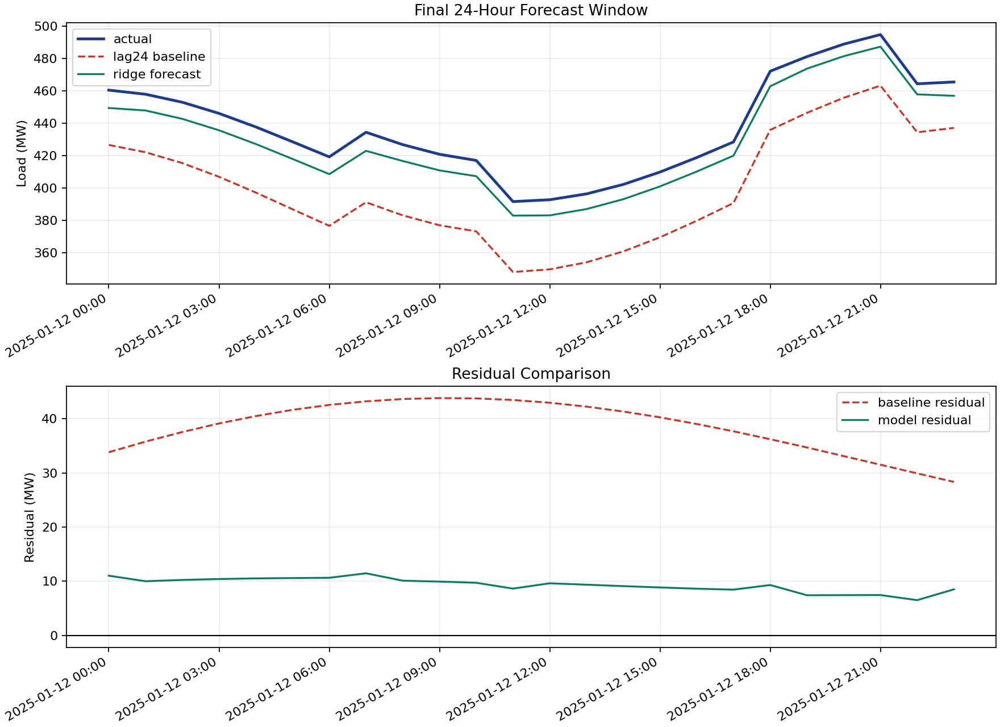

# Energy Load Forecasting



## Problem

Forecast hourly power demand from weather measurements, industrial activity, calendar effects, and autoregressive lags.

## Data

File: `data/energy_load.csv`

Columns:

- `timestamp`
- `temperature_c`
- `humidity_pct`
- `wind_kph`
- `is_holiday`
- `industrial_index`
- `load_mw`

## Method

The pipeline builds a feature matrix with:

- current weather and operating variables
- cyclic hour and day-of-week encodings
- lag-1 and lag-24 demand features

The model is a ridge regressor evaluated on a walk-forward split. A small time-series validation search is used to choose the regularization strength before comparing the final model to a naive day-ahead baseline.

## Key Results

- Ridge regression improves test RMSE from `38.853 MW` for the lag-24 baseline to `15.314 MW`
- Test MAPE drops from `8.909%` to `3.388%`
- Validation chooses `alpha = 10.0` from a time-series regularization search

## Benchmarks

| Method | Test RMSE (MW) | Test MAPE |
| --- | ---: | ---: |
| Lag-24 baseline | 38.853 | 8.909% |
| Ridge regression | 15.314 | 3.388% |

Detailed benchmark artifacts are saved in [RESULTS.md](RESULTS.md) and `outputs/alpha_search.csv`.

## Run

```bash
python 01_energy_load_forecasting/src/forecasting_pipeline.py
```

## Output

The script reports:

- baseline vs model RMSE and MAPE
- selected regularization strength and alpha search table
- the most influential coefficients
- the final 24-hour forecast window
- saved diagnostic plot in `outputs/forecast_diagnostics.png`
