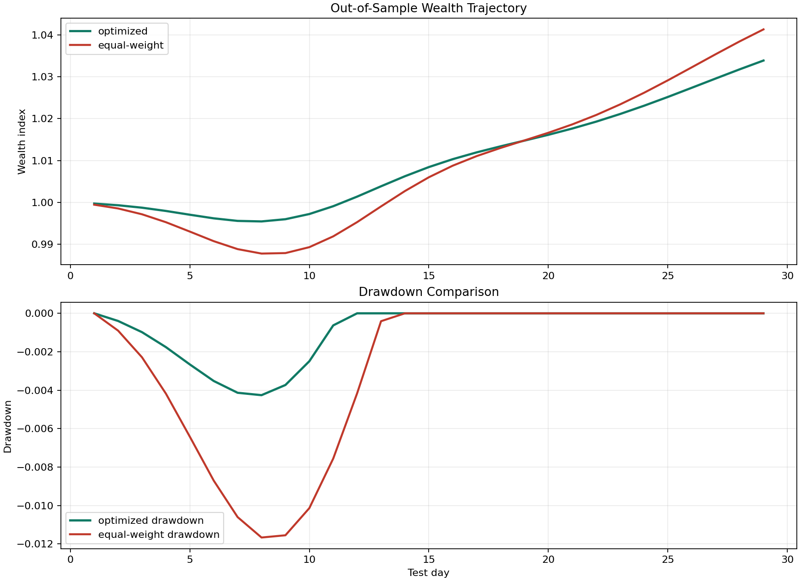

# Portfolio Optimization and Risk



## Problem

Construct a portfolio from historical price data, optimize asset weights under a return constraint, and compare the resulting strategy against an equal-weight benchmark.

## Data

File: `data/asset_prices.csv`

Assets:

- `ALPHA`
- `BETA`
- `GAMMA`
- `DELTA`

## Method

The project:

- converts price history into log returns
- estimates mean returns and covariance on a training window
- searches the simplex for a minimum-variance allocation with a return floor
- backtests the allocation on a holdout segment
- computes volatility, Value at Risk, Conditional Value at Risk, and maximum drawdown
- exports an efficient frontier table and a compact stress-test table

## Key Results

- The optimized allocation shifts capital toward lower drawdown and lower tail risk
- Annualized volatility falls from `0.0312` for equal-weight to `0.0180` for the optimized portfolio
- Maximum drawdown improves from `-0.0117` to `-0.0043`

## Benchmarks

| Strategy | Annual Return | Annual Volatility | VaR95 | CVaR95 | Max Drawdown |
| --- | ---: | ---: | ---: | ---: | ---: |
| Equal-weight | 0.4221 | 0.0312 | 0.0021 | 0.0023 | -0.0117 |
| Optimized | 0.3359 | 0.0180 | 0.0008 | 0.0009 | -0.0043 |

See [RESULTS.md](RESULTS.md), `outputs/efficient_frontier.csv`, and `outputs/stress_test.csv` for richer comparisons.

## Run

```bash
python 04_portfolio_optimization/src/portfolio_analysis.py
```

## Output

The script reports:

- optimized weights
- benchmark comparison
- out-of-sample tail-risk metrics
- backtest wealth trajectory summary
- saved backtest plot in `outputs/portfolio_backtest.png`
