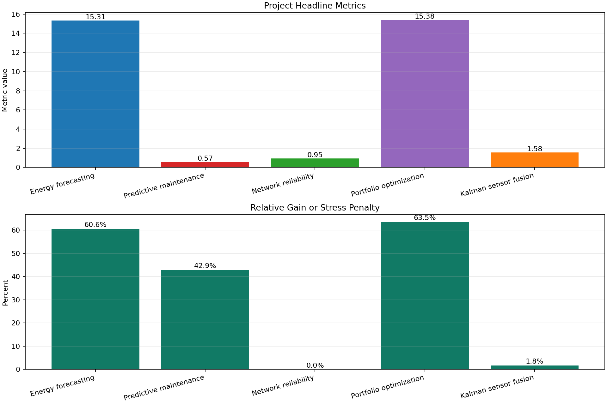
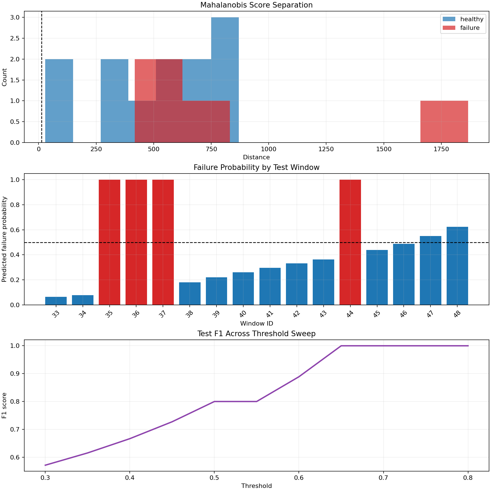
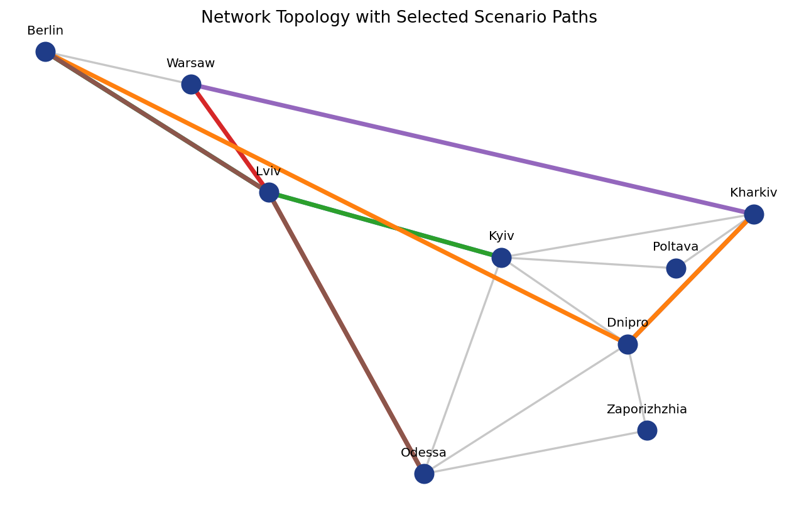
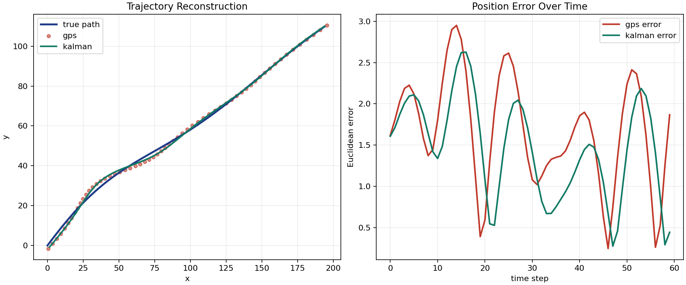

# Applied Mathematics and Computer Engineering Projects


This repository is a compact engineering showcase built around five data-driven mini-projects. The emphasis is on mathematical modeling, numerical methods, optimization, inference under uncertainty, and clear output artifacts that read like finished analytical work rather than classroom exercises.

## What Is Inside

- 5 self-contained projects with data, code, documentation, and generated artifacts
- benchmark tables, robustness checks, and scenario analysis
- unified CLI entry points for every project
- a root launcher that rebuilds everything end-to-end
- a repository-level dashboard that summarizes all projects in one place
- a Streamlit demo for interactive browsing

## Skills Demonstrated

- applied mathematics: regression, optimization, state-space modeling, Monte Carlo simulation, covariance analysis
- computer engineering: reproducible pipelines, CLI tooling, benchmarking, artifact generation, scenario testing
- data analysis: feature engineering, risk metrics, stress testing, calibration checks, model comparison
- software quality: unit tests, CI, structured outputs, deterministic scripts

## Project Index

| Project | Focus | Strongest additions |
| --- | --- | --- |
| `01_energy_load_forecasting` | Time-series demand prediction | feature ablations, regime breakdown |
| `02_predictive_maintenance` | Failure-risk scoring | business-cost comparison, sensor-drift stress test |
| `03_network_reliability` | Reliability-aware routing | resilience summary, degraded-path check |
| `04_portfolio_optimization` | Allocation and backtesting | rolling rebalancing with transaction costs |
| `05_kalman_sensor_fusion` | State estimation | dropout robustness sweep, RTS smoothing |

## Repository Dashboard

The root-level dashboard aggregates the strongest headline metric from each project and shows either relative improvement or stress sensitivity.



Generated overview artifacts:

- `outputs/overview_dashboard.png`
- `outputs/overview_metrics.csv`

## Gallery

### 01 Energy Load Forecasting

Short-term load prediction with linear baselines, ridge regression, feature ablation, and regime-aware error analysis.


Quick files:
- [README](01_energy_load_forecasting/README.md)
- [Results](01_energy_load_forecasting/RESULTS.md)

### 02 Predictive Maintenance

Failure prediction from industrial sensor windows with unsupervised monitoring, supervised classification, and drift robustness checks.



Quick files:
- [README](02_predictive_maintenance/README.md)
- [Results](02_predictive_maintenance/RESULTS.md)

### 03 Network Reliability

Constraint-aware telecom routing with reliability scoring, Monte Carlo availability checks, and scenario resilience reporting.



Quick files:
- [README](03_network_reliability/README.md)
- [Results](03_network_reliability/RESULTS.md)

### 04 Portfolio Optimization

Optimization and backtesting under tail-risk constraints with efficient frontier export and rolling rebalancing.


Quick files:
- [README](04_portfolio_optimization/README.md)
- [Results](04_portfolio_optimization/RESULTS.md)

### 05 Kalman Sensor Fusion

Trajectory reconstruction from noisy sensors with filtering, smoothing, and dropout stress scenarios.



Quick files:
- [README](05_kalman_sensor_fusion/README.md)
- [Results](05_kalman_sensor_fusion/RESULTS.md)

## Quick Start

Install dependencies:

```bash
pip install -r requirements.txt
```

Run all projects and rebuild every tracked artifact:

```bash
python run_all.py
```

Launch the interactive app:

```bash
streamlit run streamlit_app.py
```

You can also regenerate only the repository-level overview after the project outputs exist:

```bash
python build_dashboard.py
```

## Engineering Signals

- explicit baselines instead of only reporting the final model
- scenario stress tests and robustness checks
- reproducible CSV outputs for inspection outside Python
- consistent command-line interfaces across projects
- an interactive app for recruiter-friendly browsing
- unit tests and CI for core numerical helpers
- compact plots that make performance differences easy to scan on GitHub

## Testing

```bash
python -m unittest discover -s tests
```
